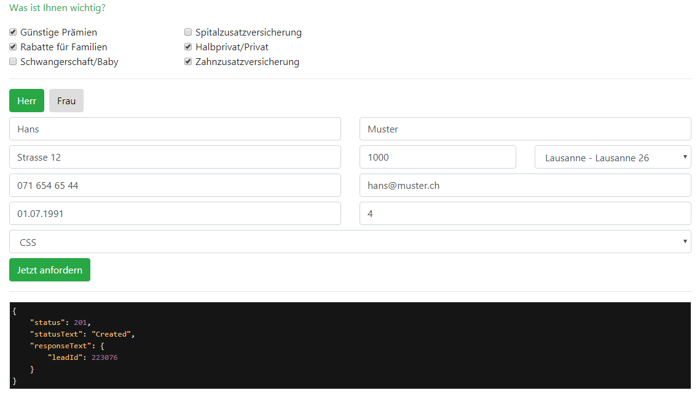

#Example lead form with Javascript 
Download project
Make necessary changes on the API code part which is in the index.html


``` js 
var api = new InsurandoAPI('<baseurl>', '<username>', '<password>');
```

Project ready for test


---
---

